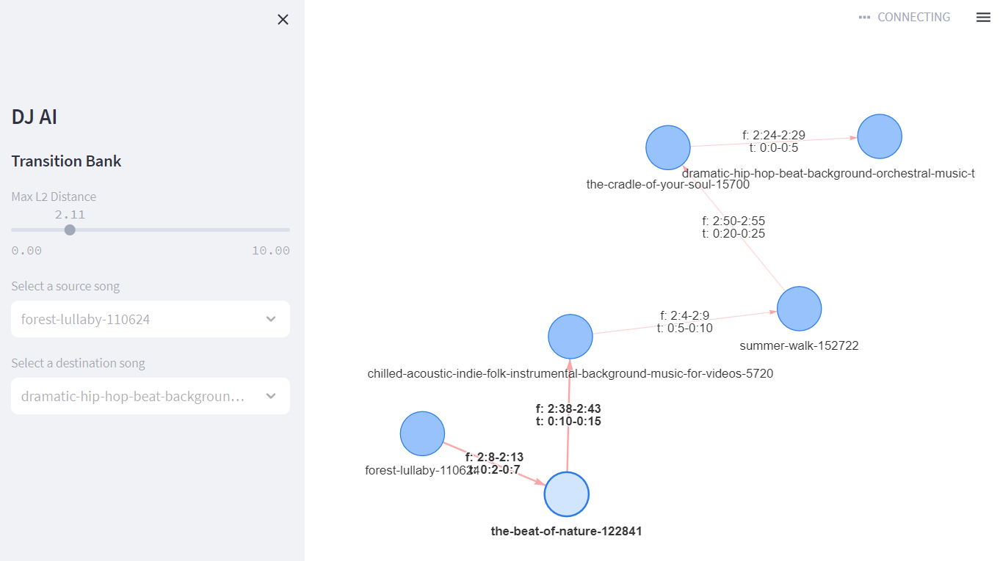

# DJAI Map

<!-- Insert preview.png -->
<center>

</center>

## Table of Contents

- [Description](#description)


## Description

Quick little hackathon to try and create a "transition map" between songs using an encoder-based transformer model.

## Installation
First install pdm via `pip install pdm` and then run

```bash
pdm install
```
Alternatively
```bash
pip install .
```

## Usage

```bash
djai-map --help
```
